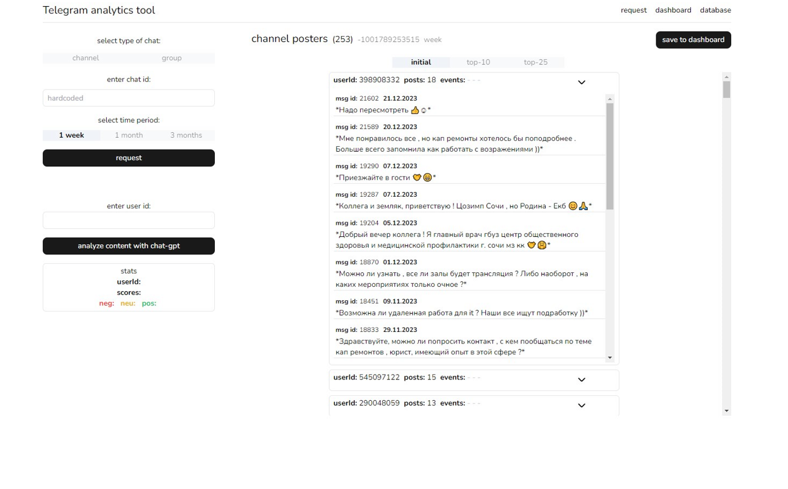

# TG Scrapper 
Tool for scrapping data from Telegram group chat. 

#### Preview 
<center></center>

## Techs
Vite, React, Context API, Express, ElephantSQL, TailwindCSS, Telegram\Bot API, Chat-GPT API.

## Run

Backend: 
```js
cd server
npm install 
npm run start
```
   
Frontend: 
```js
cd client
npm install 
npm run dev

```

## Usage
Easy as one-two-three flow gives you histroy of certain group chat. <br>
Follow these steps: <br>
    * Request history of group chat by ID (with prefix '-'). <br>
    * Filter list and send it to dashboard where you can preview and make changes boefore saving. <br>
    * After sending to database, you can visit 'database' page for data presentation. <br>
<br>
Experemental feature: <br>
    * Analyze users messages for positive/negative/neutral content with help of Chat-GPT.<br>

## About 
The main goal is to ingtegrate elements of gamification in thematical communities chats. <br>
Project works in pair with Telegram Bot, which can registrate user in live events and notify about any updates. 